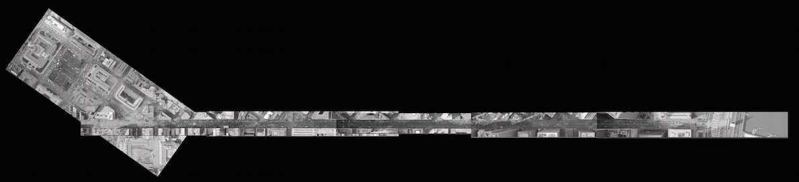

Estimating the Number of Protestors in the San Francisco Anti-War Protest
========================================================

Introduction
-------------------------
In early 2001, many peaceful marches were held around the country in protest of the US involvement in Iraq. One of these protest took place in San Francisco, California. The *San Francisco Chronicle*'s estimated the total number of protestors by taking aerial shots of the protest from more than 2000 ft above. They estimated about 65,000 protesters at the time the photos were taken. The purpose of this analysis is to try to replicate their estimate. Using the same *San Francisco Chronicle*'s aerial photographs of the protest we verified their estimate was appropriate. Our estimate rounded to the nearest thousand was **60386.25** confirming *San Francisco Chronicle* estimate. Below you can find the methods used to construct our estimate along with a discussions on potential limitations of the data/findings.

Methodology
-------------------------

The first step to conduct our estimate was to piece together the six photos that were provided by the *San Francisco Chronicle* using a photo editor like *photoshop*. Since some of the photos included parts of other photos the six photos were manually combined into one unifying picture (Reference 1). This was done to avoid over counting. A grid was placed onto the unified photo, making sure the individual squares in the grid were not too large or too small. Each square was numbered if at least one person could be seen either walking or standing (Reference 2). We then used stratified sampling to find the estimated total number of protestors. In order to use stratified sampling we found/defined five things:   

1.) **Observation Unit**  
The observation unit was defined to be any person that can be seen walking/standing in our photo. 

2.) **Sampling Unit**  
The sampling unit was defined to be any grid that consisted of at least one observation unit. Each sampling unit was numbered.  

3.) **Population Size**  
The population size was the total amount of sampling units, which was found to be 582.  

4.) **Stratums**  
Since the density of the crowds varied over the route, the grids were seperated into five stratums. The stratums were defined based on the density in each sampling unit. Sampling units were sorted into a single stratum based on the following conditioins:  

&nbsp;&nbsp;&nbsp;&nbsp;&nbsp;&nbsp; i.)Stratum 1: 10% or less of the sampling unit is filled with observation units.
  
&nbsp;&nbsp;&nbsp;&nbsp;&nbsp;&nbsp; ii.) Stratum 2: 11%-25% of the sampling unit is filled with observation units.
  
&nbsp;&nbsp;&nbsp;&nbsp;&nbsp;&nbsp; iii.)Stratum 3: 26%-50% of the sampling unit is filled with observation units.

&nbsp;&nbsp;&nbsp;&nbsp;&nbsp;&nbsp; iv.)Stratum 4: 51%-75% of the sampling unit is filled with observation units.

&nbsp;&nbsp;&nbsp;&nbsp;&nbsp;&nbsp; v.)Stratum 5: 75%-100% of the sampling unit is filled with observation units.   

Visual estimates were used to place each grid into its appropriate stratum. A representative sample of grids for each density was selected. The totals for each group were examined to ensure there were not extreme deviations. This tested the original visual estimate that had assigned grids to density groups. If necessary, a sample grid's category was changed to reflect the count.  A *cvs* file named *DATA.csv* containing all this information was made.

5.)  **Allocation of the Sample**  
Six percent of the grids of each stratum were selected after the grids were sorted. If a stratum was too small then at least two grids were sampled.  


Finally averaging for each stratum then multiplying this by the amount of grids in that stratum gives the estimated number of protesters for each stratum. Adding these estimates gives the overall estimated number of protestors in the San Francisco protest at the time the picture was taken. 
  
Results
-------------------------
The total number of grids that were included (sampling units) was 582. The size of each stratum is given below. 
```{r}
DATA= read.csv(file="DATA.csv") #each column in DATA.cvs represents a different strata
colSums(!is.na(DATA)) #The size of each stratum
```

Six percent of the grids for each stratum were sampled randomly using the *R* code found in *References* (Reference 3). Our random samples are given below. Each number in the a stratum represents a particular grid (Reference 2).


  * Stratum 1: 112 404 289 401 542 390 581 209 233 421 386 239 423 145 177 399 
  
  * Stratum 2: 24 213 278 570 130 63
  
  * Stratum 3: 326 39 334 470
  
  * Stratum 4: 459 359 457 357 481 117
  
  * Stratum 5: 305 374 475
  
  
There was a total of 35 samples. If the  The average number of observation units for each stratum is given below (Reference 4).

  * Stratum 1: 6.875
  
  * Stratum 2: 33.83 
  
  * Stratum 3: 167
  
  * Stratum 4: 244.857  
  
  * Stratum 5: 426 

The estimatated number of protesters in each stratum is graphed below.
```{r}
Nh=colSums(!is.na(DATA)) 
pop.str=c(stratum.1=6.875*Nh[[1]],stratum.2=38.83*Nh[[2]],stratum.3=167*(Nh[[3]]),stratum.4=244.857*(Nh[[4]]),stratum.5=426*(Nh[[5]]))
total.pop=sum(pop.str)
pl=c(pop.str,total.pop)
names(pl)[6]="total"
barplot(pl,ylab="Estimated Protesters", names.arg = c("Stratum 1","Stratum 2","Stratum 3","Stratum 4","Stratum 5", "Total"), axisnames=TRUE)

pl
```

  
sAdding these estimates gives the overall estimated number of protestors in the San Francisco protest at the time the picture was taken, which we estimated at **BLABLABLA**. 
The variance of our estimate was **BLA**(Reference 5). 
With a 95% confidence interval of **BLA**(Reference 6).

Discussion
-------------------------
Taking more samples from stratums that have higher variances and less samples from samples with lower variances would most likely give a better estimate, also increasing the total sample size can improve the accuracy of our estimate. However, these methods are time consuming and therefore not worth the small increase in accuracy.   
A limitation of the data was the use of visual estimates to sort grids into their stratums. The visual estimates were done by first deciding what sampling unit belonged to what stratum. For example, if sampling unit was almost entirely full with protesters then it was placed in the 76-100% stratum.

Summary
-------------------------
Following the methods describe above the estimated number of protestors was estimated at **BLA**. With a 95% confidence interval of **BLA**. Our estimate confirms the *San Francisco Chronicle*'s estimate of 65,000. 

References
-------------------------
(1)   
```{r photo1.png, echo = F, results = 'asis'}
#cat('\n\n')
```

(2)  
```{r photo2.png, echo = F, results = 'asis'}
#cat('\n\n')
```

(3)
```{r}
#random sample generator 
sample.pa=round(colSums(!is.na(DATA))*(.06))
w=sum(sample.pa)
v=NA
for(i in 1:5){
  x=sample(DATA[,i][!is.na(DATA[i])],sample.pa[[i]])
   if(sample.pa[i]==0){
       y=sample(DATA[,i][!is.na(DATA[i])],2)
       x=y[!is.na(y)]   
       w=w+2 
       v=sample.pa
       v[i]=2
       }
  print(paste("Stratum",i))
  print(x)
}
paste("Total Sampled ",w)
```

(4)
```{r}
#
a.1=(c(11,4,5,7,2,0,3,18,16,0,0,11,0,12,17,4))
b.1=(c(27,67,30,23,46,40))
c.1=(c(157,135,186,190))
d.1=(c(248,278,209,207,265,220,287))
e.1=(c(435,397,446))

mean(a.1)
mean(b.1)
mean(c.1)
mean(d.1)
mean(e.1)
```
(5)
```{r}
#y=list(a.1,b.1,c.1,d.1,e.1)
#sum=0
#for(i in 1:5){

#  x=((1-(v[[i]]/(colSums(!is.na(DATA))[[i]])))*((colSums(!is.na(DATA))[[i]])^2)*((var(y[[i]]))/v[[i]]))
#  sum=sum+x

#}
#print(paste("The estimated variance of our stratified sample estimate is", sum, ""))
```
(6)
```{r}
#lower.bound=332-1.96*sum
#higher.bound=332+1.96*sum
#confidence.interval=c(lower.bound,higher.bound)
#confidence.interval
```
